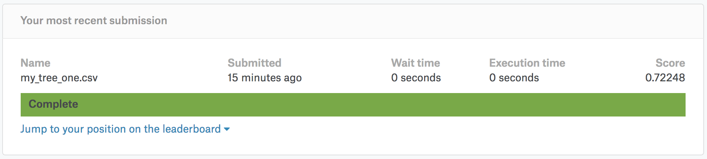

# kaggle_Titanic 「タイタニックの生存者予測」  
Titanic: Machine Learning from Disaster  
https://www.kaggle.com/c/titanic  

---

## 1. my_tree_one.csv  
### 精度：0.72248  

  

## 2.
### 精度：

---

## 参考
[【Kaggle初心者入門編】タイタニック号で生き残るのは誰？](https://www.codexa.net/kaggle-titanic-beginner/)   

